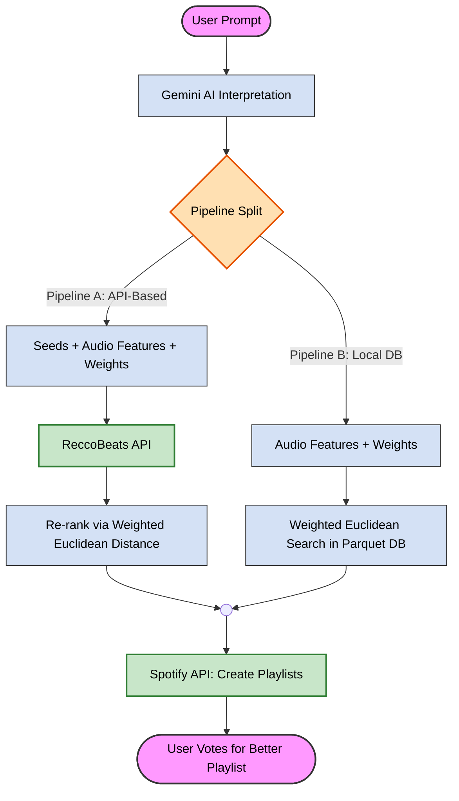

# Promptify: AI-Powered Playlist Generation 🎵
### *<u>Authors: Daniel Laroz and Omer Shapira</u>*

## Live Demo
[https://promptify-nlanmqgwehn5zr59dwxhlf.streamlit.app](https://promptify-nlanmqgwehn5zr59dwxhlf.streamlit.app)

---

## Table of Contents

1. [Introduction](#Introduction)
   - [Background and Motivation](#Background-and-Motivation)
   - [Project Goals](#Project-Goals)
   - [Research Question](#Research-Question)
     
2. [System Design](#System-Design)
    - [High-Level Architecture](#High-Level-Architecture)
    - [Technologies](#Technologies)
     
3. [Methods & Algorithms](#Methods--Algorithms)
    - [The Prompt Engineering Challenge](#The-Prompt-Engineering-Challenge)
    - [Pipeline A: API-Based Recommendations (ReccoBeats)](#Pipeline-A-API-Based-Recommendations-ReccoBeats)
    - [Pipeline B: Local Database Search](#Pipeline-B-Local-Database-Search)
    - [Data Preprocessing](#Data-Preprocessing)
    - [Search Algorithm: Weighted Euclidean Distance](#Search-Algorithm-Weighted-Euclidean-Distance)
   
4. [Experimental Setup](#Experimental-Setup)
    - [Methodology](#Methodology)
    - [Data Collection](#Data-Collection)
    - [Example Prompts](#Example-Prompts)

5. [Results](#Results)
   
6. [Implementation & Demo](#Implementation--Demo)
    - [User Interface](#User-Interface)

7. [Code Overview](#Code-Overview)
    - [Project Structure](#Project-Structure)
    - [Key Components](#Key-Components)
     
8. [Conclusions](#Conclusions)
    - [Preliminary Observations](#Preliminary-Observations)
    - [Limitations](#Limitations)
    - [Future Improvements](#Future-Improvements)

9. [Usage](#Usage)

10. [References](#References)

---

## Introduction

Promptify is a web-based music recommendation system that allows users to generate Spotify playlists using natural language descriptions. Instead of manually searching for songs, users can describe their desired mood, activity, or atmosphere in plain English - such as *'energetic workout music with heavy beats'* or *'calm acoustic songs for studying'* - and receive personalized recommendations.

The system is designed around a comparative architecture: it utilizes two different recommendation pipelines to provide results. Users can then vote on which playlist better matches their intent, enabling a data-driven comparison of different recommendation approaches.

### Background and Motivation

Human musical preferences are frequently expressed through abstract concepts involving atmosphere or moods. However, standard search mechanisms often rely on specific artist names, track titles, or distinct genres. These traditional methods often fail to capture semantic nuances, making it difficult to map abstract user descriptions to relevant musical content.

### Project Goals

The objective of Promptify is to automate the translation of abstract user intent into a curated list of tracks.
The solution leverages the Natural Language Processing (NLP) capabilities of Google Gemini to analyze free-text prompts. The system distills this text into quantifiable audio parameters and features, which serve as the foundation for the search and retrieval process.

### Research Question

**Which approach yields better playlist recommendations: an API-based method that leverages external recommendation algorithms, or a local database search using weighted similarity metrics?**

Beyond the system implementation, this project focuses on a comparative study of these two algorithmic approaches, evaluating their effectiveness through collected user feedback and runtime comparison.

---

## System Design

### High-Level Architecture



### Technologies

| Component | Technology | Rationale |
|-----------|------------|-----------|
| **LLM** | Google Gemini 2.5 Flash Lite | Supports structured output and fast inference |
| **Backend** | Python | Ease of development using libraries well suited to the project (NumPy, Pandas, API clients) |
| **Music Data API** | ReccoBeats API | Provides recommendation endpoints with audio feature filtering |
| **Music Integration** | Spotify Web API (Spotipy) | Industry standard, rich metadata, playlist creation |
| **Local Database** | Parquet (PyArrow) | Columnar storage, fast vectorized operations with NumPy |
| **Frontend** | Streamlit | Rapid prototyping, built-in state management, easy deployment |
| **Data Collection** | Google Sheets API (gspread) | Simple vote logging, real-time collaboration |

---

## Methods & Algorithms

### The Prompt Engineering Challenge

The first challenge is translating a user's abstract natural language prompt into quantifiable audio features. We use Google Gemini with structured output (Pydantic schemas) to ensure consistent, parseable responses.

**Audio Features Used:**

| Feature | Range | Description |
|---------|-------|-------------|
| `acousticness` | 0.0 - 1.0 | Confidence measure of acoustic sound |
| `danceability` | 0.0 - 1.0 | Suitability for dancing based on tempo, rhythm stability, beat strength |
| `energy` | 0.0 - 1.0 | Perceptual measure of intensity and activity |
| `tempo` | 0 - 250 BPM | Estimated beats per minute |
| `valence` | 0.0 - 1.0 | Musical positiveness (0 = sad, 1 = happy) |
| `popularity` | 0 - 100 | Estimated popularity |

**Weight System:**

For each feature, Gemini assigns an importance weight (0.0 to 1.0):
- **1.0** = Critical constraint (must match closely)
- **0.0** = Irrelevant (ignore this feature)

This allows the system to understand that "upbeat workout music" should heavily weight `energy` and `tempo`, while "chill background music" should prioritize `acousticness` and low `energy`.

---

### Pipeline A: API-Based Recommendations (ReccoBeats)

**Description:** This pipeline leverages external algorithmic recommendations from the ReccoBeats API, then re-ranks the results locally using our similarity metric.

**Process:**

1. **Gemini Interpretation:** The user prompt is sent to Gemini with a schema that requires:
   - Target audio feature values
   - Feature weights
   - **5 seed songs** (track name + artist name)

2. **Seed Resolution:** The suggested seed songs are searched on Spotify to obtain their track IDs. Invalid or non-existent songs are filtered out.

3. **API Request:** The ReccoBeats API is called with:
   - Seed track IDs
   - Target audio feature values
   - Request for 40 candidate tracks

4. **Re-Ranking:** The 40 candidates are ranked using **Weighted Euclidean Distance** against the target features. The top 10 tracks are selected.

```python
# Core ranking algorithm (simplified)
def rank_candidates(candidates, target, weights):
    scores = []
    for track in candidates:
        distance = sum(w * (track[f] - target[f])**2 for f, w in zip(features, weights))
        scores.append((track, distance))
    return sorted(scores, key=lambda x: x[1])
```

**Advantages:**
- Can discover tracks outside our local database
- Seed songs guide the recommendation toward the user's intent

**Disadvantages:**
- Dependent on external API availability
- ReccoBeats may occasionally recommend Track IDs that are not found on Spotify
- ReccoBeats does not support hard filtering by popularity
- The pipeline's runtime is slower

---

### Pipeline B: Local Database Search

**Description:** This pipeline performs a direct similarity search on a pre-processed local database of ~90,000 tracks using weighted Euclidean distance.

**Process:**

1. **Gemini Interpretation:** The user prompt is sent to Gemini with a simpler schema:
   - Target audio feature values
   - Feature weights
   - **No seed songs required**

2. **Database Search:** A NumPy operation calculates the weighted Euclidean distance between the target vector and all tracks in the database:

```python
# Core Algorithm: Weighted Euclidean Distance
diff = candidates_matrix - target_arr
squared_diff = diff ** 2
weighted_diff = squared_diff * weights_arr
scores = weighted_diff.sum(axis=1)  # Lower = Better match
```

3. **Result Selection:** The top 10 tracks with the lowest distance scores are selected.

**Advantages: (during the recommendation phase)**
- No external API dependency
- Faster response times
- Full control over the ranking algorithm
- Consistent, reproducible results

**Disadvantages:**
- Limited to tracks in the local database (~90K tracks vs ReccoBeats' larger catalog)
- Database reflects a snapshot in time and doesn't include new releases

---

### Data Preprocessing

The local database is constructed from a publicly available CSV dataset ([Spotify Tracks Dataset on Kaggle](https://www.kaggle.com/datasets/maharshipandya/-spotify-tracks-dataset)) comprising Spotify track metadata and audio features. The preprocessing pipeline (`songs_DB/preprocess.py`) transforms this raw data into an optimized format for fast similarity searches.

#### Step 1: Data Cleaning

The raw dataset undergoes several cleaning operations to ensure data quality:

```python
# Remove rows with missing values in critical columns
df = df.dropna(subset=['track_name', 'artists', 'track_id'] + FEATURE_ORDER)

# Remove duplicate tracks (based on track_id)
df = df.drop_duplicates(subset=['track_id'])

# Exclude tracks with invalid durations
df = df[(df['duration_ms'] >= 60000) & (df['duration_ms'] <= 900000)]  # 1-15 minutes

# Exclude tracks with invalid tempo
df = df[df['tempo'] > 0]
```

**Cleaning Rationale:**
- **Duration filtering (1-15 min):** Excludes intros, interludes, and abnormally long tracks that don't represent typical songs
- **Tempo validation:** Removes corrupted entries where BPM detection failed
- **Deduplication:** Ensures each track appears exactly once in the database

#### Step 2: Feature Normalization

All audio features are normalized to a [0, 1] range to ensure equal contribution during distance calculations:

| Feature | Original Range | Normalization Method |
|---------|----------------|---------------------|
| `tempo` | 0-250+ BPM | `clip(0, 250) / 250` |
| `popularity` | 0-100 | `clip(0, 100) / 100` |
| `acousticness` | 0.0-1.0 | `clip(0, 1)` (already normalized) |
| `danceability` | 0.0-1.0 | `clip(0, 1)` (already normalized) |
| `energy` | 0.0-1.0 | `clip(0, 1)` (already normalized) |
| `valence` | 0.0-1.0 | `clip(0, 1)` (already normalized) |

```python
def normalize_column(df, col_name):
    if col_name == 'tempo':
        return df[col_name].clip(0, 250) / 250.0
    elif col_name == 'popularity':
        return df[col_name].clip(0, 100) / 100.0
    return df[col_name].clip(0, 1)  # Safety clamp for features that are already normalized
```

#### Step 3: Storage

The final database is saved as a single Parquet file containing both metadata (`track_id`, `track_name`, `artists`, `album_name`, `track_genre`) and normalized features. Parquet's columnar format enables efficient loading of only the feature columns needed for search.

#### Data Invariants

Two critical invariants are maintained throughout the system:

**Column Order Invariant:** Features are stored in a strict order defined in `config/model_consts.py` (`acousticness`, `danceability`, `energy`, `tempo`, `valence`, `popularity`). This order is enforced in preprocessing, Gemini output schemas and the search engine, ensuring vectorized distance calculations align correctly.

**Row Alignment Invariant:** Row *i* in the features matrix corresponds exactly to row *i* in the metadata. Preprocessing stores both together in a single Parquet file. The search engine loads both from this file and **never reorders one independently of the other**, ensuring that indices returned from similarity search correctly map to track metadata.

**Database Statistics:**
- Final size: ~90,000 tracks after cleaning
- File format: Parquet (float32 precision)

---

### Search Algorithm: Weighted Euclidean Distance

Both pipelines use the same core similarity metric:

$$\text{Distance Squared} = \sum_{i=1}^{n} w_i \cdot (x_i - t_i)^2$$

Where:
- $x_i$ = candidate track's feature value (normalized to 0-1)
- $t_i$ = target feature value
- $w_i$ = feature weight (0.0 = ignore, 1.0 = critical)

Lower distance = better match.

---

## Experimental Setup

### Methodology

We designed an A/B testing framework where users generate playlists using both pipelines simultaneously and vote for the playlist that better matches their prompt.

**Voting Options:**
- **Option A is Better** (Pipeline A wins)
- **Option B is Better** (Pipeline B wins)
- **It's a Tie** (Both equally good)

**Important:** Users are **not informed** which pipeline corresponds to which option.

### Data Collection

Each vote records:
- Timestamp
- User's original prompt
- Vote result (V1 / V2 / Tie)
- Number of tracks in each playlist
- Voter's Spotify display name
- Runtime of each pipeline (seconds)

All data is logged to a Google Sheet for analysis.

### Example Prompts

The app's UI encourages users to describe moods, vibes, or activities, for example:

| Category | Example Prompts |
|----------|-----------------|
| Mood-based | "Melancholic songs for a rainy evening" |
| Activity-based | "High-energy workout music" |
| Genre-specific | "90s hip-hop classics" |
| Scenario-based | "Background music for a dinner party" |
| Abstract/Poetic | "Songs that feel like a sunset at the beach" |

---

## Results

### Voting Data

| Metric | Value |
|--------|-------|
| Total Votes | 15 |
| Pipeline A Wins | 9 (60%) |
| Pipeline B Wins | 6 (40%) |
| Ties | 0 (0%) |

### Performance Comparison

| Metric | Pipeline A (API) | Pipeline B (Local) |
|--------|------------------|-------------------|
| Average Runtime | 4.9292 seconds | 1.3954 seconds |
| Success Rate | 100% | 100% |

### Analysis by Prompt Type

| Prompt Category | Pipeline A Wins | Pipeline B Wins | Ties |
|-----------------|-----------------|-----------------|------|
| Activity-based | 3 | 4 | 0 |
| Genre-specific | 2 | 2 | 0 |
| Scenario-based | 4 | 0 | 0 |

**Observations by Category:**
- **Activity-based prompts** (e.g., "workout music", "studying", "cleaning"): Pipeline B performed slightly better, winning 4 out of 7 prompts.
- **Genre-specific prompts** (e.g., "classic rock", "Brit rock"): Both pipelines performed equally well, each winning 2 votes.
- **Scenario-based prompts** (e.g., "birthday", "pool party", "celebration"): Pipeline A won all 4 prompts, which may suggest that seed-based recommendations are better suited to capture the nuanced vibe of specific scenarios.

---

## Implementation & Demo

### User Interface

The Streamlit application provides a clean and intuitive interface:

**1. Login Screen**

Users authenticate with their Spotify account via OAuth 2.0 to enable playlist creation.


**2. Prompt Input**

Users enter a free-text description of their desired playlist.


**3. Results & Voting**

Both playlists are displayed side-by-side with links to listen on Spotify. Users vote for their preferred option.


---

## Code Overview

### Project Structure

```
Promptify/
├── app.py                      # Main Streamlit application
├── requirements.txt            # Python dependencies
|
├── config/
│   ├── model_consts.py         # Feature order, playlist length, etc.
│   ├── rb_consts.py            # ReccoBeats API configuration
│   └── spotify_consts.py       # Spotify OAuth scopes
|
├── data_class/
│   └── recommendation_params.py # Pydantic models for Gemini schemas
|
├── llm/
│   └── llm_prompt_interpreter.py # Gemini API integration
|
├── pipelines/
│   ├── __init__.py             # Exports run_pipeline_v1, run_pipeline_v2
│   ├── api_pipeline.py         # Pipeline A: ReccoBeats-based
│   ├── db_pipeline.py          # Pipeline B: Local database
│   ├── search_engine.py        # Core similarity algorithms
│   └── shared.py               # Shared utilities (Gemini interpretation)
|
├── rb/
│   ├── rb_functions.py         # ReccoBeats API functions
│   └── request_sender.py       # HTTP request wrapper
|
├── songs_DB/
│   ├── preprocess.py           # Database preprocessing script
│   └── tracks_db.parquet       # Processed track database
|
├── spotify/
│   ├── auth.py                 # Spotify OAuth manager
│   └── spotify_requests.py     # Spotify API wrapper classes
|
└── tests/                      # Unit tests
```

### Key Components

**`llm/llm_prompt_interpreter.py`**

Handles communication with Google Gemini API:
- Constructs system prompts based on the target pipeline
- Enforces structured output using Pydantic schemas
- Implements retry logic (3 attempts) for failed generations

**`pipelines/search_engine.py`**

Contains the core similarity algorithms:
- `_calculate_weighted_distance()`: Vectorized weighted Euclidean distance using NumPy
- `rank_reccobeats_candidates()`: Re-ranks API results (for Pipeline A)
- `search_db()`: Searches the local database using `argpartition` for efficient top-k selection (for Pipeline B)

**`data_class/recommendation_params.py`**

Defines Pydantic models for Gemini's structured output:
- `AudioFeatures`: Target values for each audio dimension
- `FeatureWeights`: Importance weights for ranking
- `LocalSearchParams`: Schema for Pipeline B (no seeds)
- `ReccoBeatsParams`: Schema for Pipeline A (includes seeds)

---

## Conclusions

### Preliminary Observations

Based on initial testing:

1. **Response Time:** Pipeline B (Local) is consistently faster, as it does not require external API calls.

2. **Seed Quality:** Pipeline A's effectiveness heavily depends on Gemini's ability to suggest valid, relevant seed songs.

3. **Diversity vs. Precision:** Pipeline A tends to yield more diverse recommendations due to ReccoBeats' recommendation algorithm, while Pipeline B produces more precisely matched tracks.

### Limitations

**ReccoBeats API:**
- **Third-Party Replication:** ReccoBeats attempts to replicate Spotify's now-deprecated Recommendations API, but without access to Spotify's proprietary algorithms and real-time data, recommendation quality may not match the original.
- **No Genre Filtering:** ReccoBeats doesn't support filtering recommendations by genre, limiting control over stylistic output.

**Evaluation Challenges:**
- **Subjective Success Criteria:** Translating abstract prompts (e.g., "songs that feel like a sunset") into numerical audio features is inherently subjective. What constitutes a "good" recommendation is highly subjective, making quantitative evaluation of system performance challenging.

**Platform Constraints:**
- **Spotify Developer Quota:** The app operates in Spotify's development mode, which limits access to a small number of pre-approved users.

### Future Improvements

1. **Expanded Audio Features:** Add more audio dimensions such as `instrumentalness` (useful for study/focus playlists), `speechiness` (filter spoken word), and `liveness` (prefer studio vs live recordings).

2. **Metadata Filtering in Pipeline B:** Leverage existing database metadata (e.g., `track_genre`, `explicit`) to infer user intent from prompts more accurately. This would allow users to naturally request specific genres, avoid explicit content, or set duration preferences, enabling truly free-form input such as *'relaxing jazz for a coffee shop'*.

3. **Negative Seeds:** Leverage ReccoBeats' negative seeds parameter in Pipeline A to let users specify tracks they dislike or want to avoid, guiding recommendations away from similar content.

4. **Personalization:** Integrate with user's Spotify listening history and saved tracks for personalized recommendations.

5. **Larger Database:** Expand the local database or integrate with additional music data sources.

6. **Feedback Loop:** Allow users to mark individual tracks as "liked" or "disliked" to refine results.

7. **Playlist Length Customization:** Enable users to specify how many tracks they want instead of a fixed playlist size.

8. **Mood Transitions:** Support dynamic prompts like "start calm and build to energetic" by ordering tracks to create a progression throughout the playlist.

9. **Musician Mode:** Expose technical audio features (`key`, `mode`, `time_signature`) for musically-inclined users who want precise control over harmonic and structural elements.

<!-- CONCLUSIONS_PLACEHOLDER_END -->

---

## Usage

1. Navigate to this URL:
    ```bash
    https://promptify-nlanmqgwehn5zr59dwxhlf.streamlit.app
    ```

2. Click the **"Login with Spotify"** button in the sidebar

3. Sign in to your Spotify account and authorize the application

4. Enter a playlist description (e.g., "chill music for studying late at night")

5. Click **"Generate"** and wait for both playlists to be created

6. Listen to both playlists on Spotify and vote for the one that better matches your description

---

## References

- [Spotify Web API Documentation](https://developer.spotify.com/documentation/web-api)
- [Google Gemini API Documentation](https://ai.google.dev/gemini-api/docs)
- [ReccoBeats API Documentation](https://reccobeats.com/docs/documentation/introduction)
- [Streamlit Documentation](https://docs.streamlit.io/)
- [Spotipy Library](https://spotipy.readthedocs.io/)
- [gspread Library](https://docs.gspread.org/)
- [NumPy Documentation](https://numpy.org/doc/)
- [Pandas Documentation](https://pandas.pydata.org/docs/)
- [PyArrow Documentation](https://arrow.apache.org/docs/python/)
- [Spotify Tracks Dataset (Kaggle)](https://www.kaggle.com/datasets/maharshipandya/-spotify-tracks-dataset)
