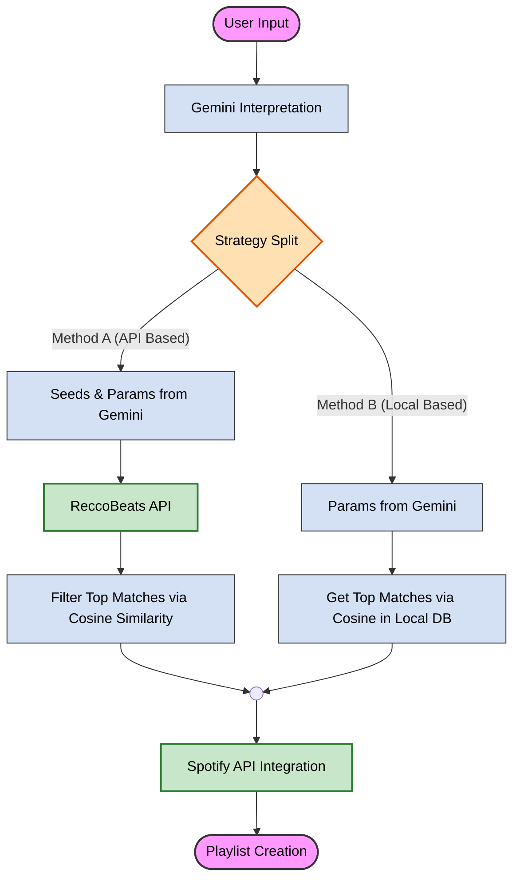

# Promptify: AI-Based Playlist Generator 🎵
### **Authors:** Daniel Laroz and Omer Shapira


*(מומלץ לשים כאן צילום מסך אסתטי של המערכת או דיאגרמה כללית)*

## Abstract
This project presents "Promptify," a system designed to bridge the gap between abstract human musical intent and rigid database search mechanisms.  
The primary goal is to enable users to generate personalized playlists based on free-text descriptions. The system leverages Large Language Models (LLMs) to process natural language inputs and translate them into quantitative audio features.  
Furthermore, we conduct a comparative analysis between two distinct playlist generation methodologies:  
(version #1) harnessing external algorithmic recommendations via an API, compared against a custom-developed heuristic model operating on a local, static repository.  
(version #2) dynamic retrieval via a Music Service API and a custom similarity algorithm applied to a static dataset.


---
## Table of Contents

1. [Introduction](#Introduction)
   - [Background and Motivation](#Background-and-Motivation)
   - [Project Goals](#Project-Goals)
   - [Contribution](#Contribution)
     
2. [System Design](#System-Design)
     
3. [Methods & Approaches](#Methods-&-Approaches)
   
4. [Experiments & Results](#Experiments-&-Results)
   
5. [Implementation & Demo](#Implementation-&-Demo)
     
6. [Conclusions](#Conclusions)

7. [Installation & Usage](#Installation-&-Usage)

8. [References](#References)

---

## Introduction
### Background and Motivation
Current music streaming platforms, such as Spotify, predominantly rely on metadata-based search mechanisms. Users are typically limited to querying by specific artist names, track titles, distinct genres, or a finite set of predefined tags. Consequently, finding a suitable playlist often requires a manual, exhaustive search process: users must browse through numerous suggested playlists, filtering them one by one to find a match that aligns with their preferences.  
This process imposes a significant cognitive load and consumes valuable time, often resulting in a compromise where the user settles for an imperfect playlist.


Moreover, human musical desires are frequently expressed through abstract concepts involving "atmosphere," "vibes," or complex scenarios (e.g., "songs for a melancholic drive on a rainy night"). Existing keyword-based search algorithms struggle to interpret these semantic nuances, failing to map abstract descriptions to the appropriate musical content.

### Project Goals
The objective of "Promptify" is to automate the translation of abstract user intent into a concrete, curated list of tracks. The solution utilizes the advanced Natural Language Processing (NLP) capabilities of modern AI (Google Gemini) to analyze the user's free-text prompt. The system distills this text into quantifiable parameters and audio features, which serve as the foundation for the search and retrieval process.

### Contribution
Beyond the system implementation, this project focuses on a comparative study of algorithmic approaches. We evaluate and contrast two distinct methods for playlist generation:

1. **Web-Based Recommendation Model:** Utilizing live API data to generate dynamic suggestions based on real-time trends and algorithms.

2. **Static Computational Model:** A custom-built algorithm applied to a pre-processed static dataset, calculating similarity and relevance locally.

---

## System Design
### High-Level Architecture


### Technologies
* **LLM:** Google Gemini (פירוט קצר למה נבחר – חלון קונטקסט, עלויות, יכולות JSON וכו').
* **Backend:** Python.
* **Music Data:** Spotify Web API (Spotipy).
* **Frontend:** Streamlit (ממשק משתמש).

---

## Methods & Approaches – *ליבת המחקר*
[זהו החלק המרכזי של הדו"ח המחקרי. כאן תתאר את שתי הגישות שהשווית ביניהן.]

### 4.1 אתגר ה-Prompt Engineering
[הסבר כיצד אתה מעבד את הקלט הגולמי של המשתמש לפני שליחתו ל-Gemini.]

### 4.2 גישה א': [תן שם לשיטה, למשל: "Direct Song Recommendation"]
* **תיאור:** בשיטה זו, אנו מבקשים מ-Gemini להחזיר ישירות רשימה של שמות שירים ואמנים על סמך התיאור.
* **תהליך:** פירוט הפרומפט שנשלח ל-Gemini, מבנה ה-JSON שמתקבל, ואיך מבוצע החיפוש בספוטיפיי (Search Query).
* **יתרונות/חסרונות תיאורטיים:** (למשל: יצירתיות גבוהה אבל עלול להמציא שירים שלא קיימים).

### 4.3 גישה ב': [תן שם לשיטה, למשל: "Audio Features Parameterization"]
* **תיאור:** בשיטה זו, Gemini לא בוחר שירים, אלא מתרגם את הטקסט לפרמטרים מספריים של ספוטיפיי (Danceability, Energy, Valence, Genre seeds).
* **תהליך:** הסבר כיצד מופו מילות תואר ("שמח", "רגוע") לערכים מספריים (0.8 Valence), ושימוש ב-Endpoint של `Get Recommendations` בספוטיפיי.
* **יתרונות/חסרונות תיאורטיים:** (למשל: מבטיח שירים קיימים, אבל אולי פחות מדויק סמנטית לכוונת המשורר).

---

## Experiments & Results
[כאן אתה משווה בין שתי הגישות שתוארו לעיל.]

### 5.1 מתודולוגיית הבדיקה
[איך בדקתם איזו שיטה טובה יותר?
* **סט בדיקה:** רשימה של 10-20 פרומפטים מגוונים (למשל: אחד מופשט, אחד מבוסס ז'אנר, אחד מבוסס נוסטלגיה).
* **מדדי הצלחה:** הערכה סובייקטיבית (משתמשים דירגו), או מדד אובייקטיבי (מרחק בין הז'אנר המבוקש לז'אנר שהתקבל).]

### 5.2 תוצאות (Results)
[הצג טבלאות או גרפים.]

| Prompt Example | Method A Result (Top 3 Songs) | Method B Result (Top 3 Songs) | User Preference |
|----------------|-------------------------------|-------------------------------|-----------------|
| "Songs for coding late at night" | Song X, Song Y... | Song Z, Song W... | Method B |
| "80s Rock workout" | ... | ... | Method A |

### 5.3 ניתוח התוצאות
* באיזה סוגי פרומפטים גישה א' ניצחה?
* באיזה סוגים גישה ב' הייתה טובה יותר?
* האם היו "הזיות" (Hallucinations) של ה-AI בגישה א'?

---

## 6. Implementation & Demo
### 6.1 אתגרים במימוש
[פרט על קשיים טכניים: טיפול ב-Rate Limits, אימות מול ספוטיפיי (OAuth), פרסום JSON לא תקין מ-Gemini ואיך פתרתם אותם (Retry logic, Parser מתוחכם).]

### 6.2 ממשק המשתמש (UI)
[צילומי מסך של המערכת בפעולה]
* **מסך הכניסה:** הזנת ה-Prompt.
* **מסך התוצאות:** הצגת הפלייליסט שנוצר, הנגן המוטמע (אם יש), וכפתור השמירה לספוטיפיי.

---

## 7. Conclusions
* **מסקנה עיקרית:** איזו גישה עדיפה בסופו של דבר? (אולי שילוב של השתיים?)
* **מגבלות:** מה המערכת לא יודעת לעשות טוב כרגע?
* **עבודה עתידית:** רעיונות להמשך (למשל: Feedback Loop בו המשתמש מסמן שירים שלא אהב והמערכת לומדת, או שילוב תמונה כקלט).

---

## 8. Installation & Usage
1.  Clone the repository:
    ```bash
    git clone [https://github.com/username/promptify.git](https://github.com/username/promptify.git)
    ```
2.  Install dependencies:
    ```bash
    pip install -r requirements.txt
    ```
3.  Set up API Keys:
    * Create `.env` file with `SPOTIFY_CLIENT_ID`, `SPOTIFY_CLIENT_SECRET`, `GEMINI_API_KEY`.
4.  Run the app:
    ```bash
    streamlit run app.py
    ```

---

## 9. References
* Spotify Web API Documentation.
* Google Gemini API Documentation.
* [מאמרים או מקורות נוספים שהשתמשתם בהם].